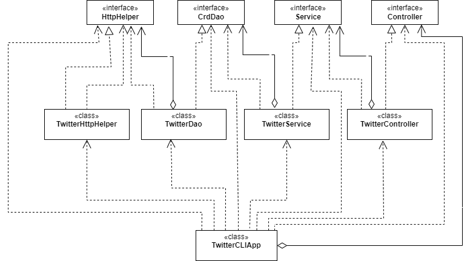

# Introduction
The Twitter app allows users to post, lookup, and delete tweets with help of Twitter REST API. The app uses the HTTP client builder to execute post and get requests that will be sent to the Twitter app. The application takes user input via CLI and converts it into HTTP request which is sent to Twitter through API. A DAO was used to manage these requests using a Tweet DTO that transferred the necessary data to and from the HTTP requests/responses from the REST API. This project used Twitter REST API, HTTP Client, maven, Docker, the spring framework, as well as few libraries were used to help manipulate string data and DTO to strings using a JSON parser. The application was tested using JUnit and Mockito to ensure proper functionality and behavior. Finally, the app was packaged using maven into an Uberjar with Springboot implemented to manage all the app's dependencies. The application was deployed using docker. 

[Docker image](https://hub.docker.com/repository/docker/sukhreetrai/twitter)

# Quick Start
Tokens needs to be exported and setup as environment variables by using following:
```
export consumerToken=[yourConusmerToken]
export consumerSecret=[yourConsumerSecret]
export accessToken=[yourAccessToken]
export tokenSecret=[yourTokenSecret]
```
- Running the application using Docker:
```
#pull docker image or build it using the Dockerfile
docker pull ${Docker_user}/twitter

#run docker image using docker
docker run --rm -e consumerToken=${consumerToken} -e consumerSecret=${consumerSecret} \
-e accessToken=${accessToken} -e tokenSecret=${tokenSecret} sukhreetrai/twitter \
post|show|delete [options]
```

# Design
## UML diagram


- **App/Main**:

    This layer is responsible for declaring and instantiating all components and calling the run method which calls the corresponding controller method according to user input. This layer also makes sure if user has specified the right arguments in their command. 

- **HttpHelper**:

    The HttpHelpers is in charge of executing HTTP requests with a given URI while also authorizing these requests using Twitter secrets.

- **Dao**:

    The data access layer constructs tweet and URI which is then sent to Twitter REST API by using HttpHelper class. This layer also returns simplified tweet object with the help of JSON Parser.

- **Service**:

    The service layer handles any business logic such as tweet cannot exceed 140 characters and calls the DAO layer to interact with the underlying service of the Twitter REST API.

- **Controller**:

    The controller layer interacts and parses user input (CLI arguments) and makes sure all arguments needed to run specified command are included such as if user is posting a tweet, [id,longitude,latitude] are required, then calls the service layer and returns its results.

## Models
The Tweet DTO simplified version model consists of the following to manage the Tweet data:
```
String createdAt
BigInteger id
String idString
String text
Coordinates coordinates
int retweetCount
int favoriteCount
boolean favorited
boolean retweeted
```
## Spring
- The project's dependencies were handled using Spring, more specifically spring-boot added to the maven POM file, to ensure all dependencies were set up properly when the app was run. This was accomplished using the component scan approach. Annotations were used to inform the IoC container which objects needed to be injected without needing any additional class files to do so. 

# Test
Every class object was tested Junit and Mockitos in the following ways:
- integration tests to ensure that the objects were functioning correctly with each other and exceptions were handled.
- Unit tests using Mockito were done to ensure proper object behaviors by mocking their input and output to see if the methods would behave any differently. This ensured that ourapp runs independent of if Twitter works or not. 

## Deployment
Maven was used to build an uber jar of the application and then app was dockerized by creating a Dockerfile as follows:
```
FROM openjdk:8-alpine
COPY target/twitter*.jar /usr/local/app/grep/lib/twitter.jar
ENTRYPOINT ["java","-jar","/usr/local/app/grep/lib/twitter.jar"]
```
Docker image was posted on dockerHub, anyone can run the app through a Docker container without needing to worry about anything.

# Improvements
- Improve exception management from the Twitter API which enables developer to debug errors messages easily.
- Adding hashtag and user mentioning capabilities.
- Searching tweet by text could be great improvement.

